# Week 3<!-- omit in toc -->

- [Overview](#overview)
- [Mergesort](#mergesort)
  - [Abstract in-place merge demo](#abstract-in-place-merge-demo)
  - [Merging: Java implementation](#merging-java-implementation)
  - [Assertions](#assertions)
  - [Mergesort Java implementation](#mergesort-java-implementation)
  - [Mergesort empirical analysis](#mergesort-empirical-analysis)
  - [Mergesort Number of compares and array accesses.](#mergesort-number-of-compares-and-array-accesses)
    - [Pf1. [assuming $N$ is a power of 2]](#pf1-assuming-math-xmlnshttpwwww3org1998mathmathmlsemanticsmrowminmimrowannotation-encodingapplicationx-texnannotationsemanticsmathn-is-a-power-of-2)
    - [Pf2. proof by expansion](#pf2-proof-by-expansion)
    - [Pf3. proof by induction](#pf3-proof-by-induction)
  - [Mergesort memory](#mergesort-memory)
  - [Mergesort improvements](#mergesort-improvements)
    - [Use insertion sort for small subarrays](#use-insertion-sort-for-small-subarrays)
    - [Stop if already sorted.](#stop-if-already-sorted)
    - [Eliminate the copy to the auxiliary array.](#eliminate-the-copy-to-the-auxiliary-array)
  - [Buttom-up Mergesort](#buttom-up-mergesort)
    - [Java implementation](#java-implementation)
- [Complexity of sorting](#complexity-of-sorting)
  - [Example -Sorting](#example--sorting)
    - [Decision tree for 3 distinct item](#decision-tree-for-3-distinct-item)
    - [Compare-based lower bound of sorting](#compare-based-lower-bound-of-sorting)
  - [Complexity results in context](#complexity-results-in-context)
  - [Complexity results in context (cont)](#complexity-results-in-context-cont)
- [Comparator](#comparator)
  - [Comparable interface review](#comparable-interface-review)
  - [Comparator](#comparator-1)
- [Stability](#stability)
  - [Insertion sort](#insertion-sort)
  - [Selection sort](#selection-sort)
  - [Shell sort](#shell-sort)
  - [Merge sort](#merge-sort)
- [Quicksort](#quicksort)
  - [Partitioning](#partitioning)
    - [Java code](#java-code)
  - [Quicksort Java Implementation](#quicksort-java-implementation)
    - [Implementation details](#implementation-details)
  - [Empirical analysis](#empirical-analysis)
    - [Average-case analysis](#average-case-analysis)
  - [Summary for performance](#summary-for-performance)
  - [Quicksort properties](#quicksort-properties)
  - [Practical improvement](#practical-improvement)
    - [Insertion sort small subarrays](#insertion-sort-small-subarrays)
    - [Median of sample](#median-of-sample)
  - [Selection problem](#selection-problem)
    - [Quick-select](#quick-select)
    - [Quick-selection analysis](#quick-selection-analysis)
  - [Duplicate keys](#duplicate-keys)
    - [3-way partitioning](#3-way-partitioning)
    - [Java Implementation](#java-implementation-1)
    - [Lower bound](#lower-bound)
- [Sorting application](#sorting-application)
  - [Java system sorts](#java-system-sorts)
  - [Engineering Sort](#engineering-sort)
  - [Summarize for sort algorithm](#summarize-for-sort-algorithm)

## Overview

*Our lectures this week are based on two classic algorithms that were invented over 50 years ago, but are still important and relevant today, as implementations of one or both of them are found in virtually every software system and research on new variants of these classic methods is ongoing. Our treatment ranges from the mathematical models that explain why these methods are efficient to the details of adapting them to real-world applications on modern systems.*

**Lecture: Mergesort.** We study the mergesort algorithm and show that it guarantees to sort any array of nn items with at most n \lg nnlgn compares. We also consider a nonrecursive, bottom-up version. We prove that any compare-based sorting algorithm must make at least ∼n \lg n∼nlgn compares in the worst case. We discuss using different orderings for the objects that we are sorting and the related concept of stability.

**Lecture: Quicksort.** We introduce and implement the randomized quicksort algorithm and analyze its performance. We also consider randomized quickselect, a quicksort variant which finds the kth smallest item in linear time. Finally, consider 3-way quicksort, a variant of quicksort that works especially well in the presence of duplicate keys.

**Programming Assignment:** Collinear Points. Your programming assignment is a typical example of a problem that could not be solved without a fast sorting algorithm, properly applied. It is a classic problem in computational geometry: Given a set of points in the plane, design an algorithm to find all line segments that contain 4 or more points.

**Job Interview Questions.** Algorithmic interview questions based on the lecture material.

Suggested Readings. Section [2.2](https://algs4.cs.princeton.edu/22mergesort/) and [2.3](https://algs4.cs.princeton.edu/23quicksort/) in Algorithms, 4th edition.

## Mergesort

**Basic plan**
* Divide array into two halves
* Recursively sort each half.
* Merge two halves

### Abstract in-place merge demo

**Goal** Given two sorted subarrays ```a[lo]``` to ```a[mid]``` and ```a[mid+1]``` replace with sorted subarray ```s[lo]``` to ```a[hi]```.

And ```aux``` is the extra storage space that is required.

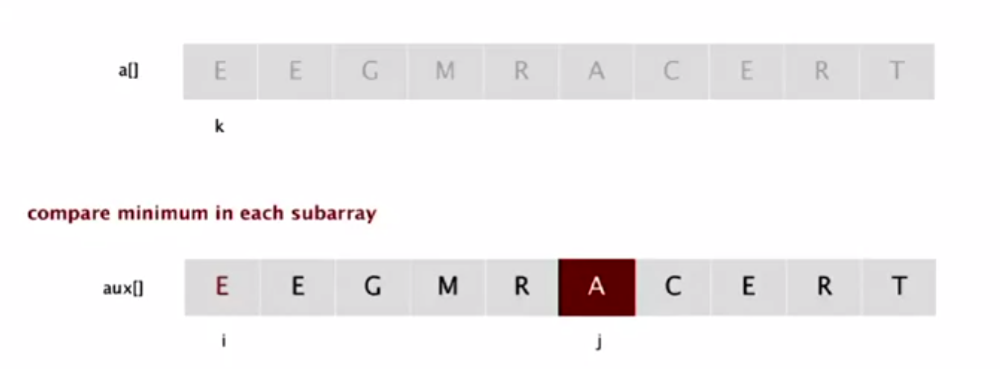

### Merging: Java implementation

```java
private static void merge(Comparable[] a, Comparable[] aux, int lo, int mid, int hi){
    assert isSorted(a, lo, mid)
    assert isSorted(a, mid+1, hi);

    // copy
    for(int k=lo;k<=hi;k++){
        aux[k] = a[k];
    }


    // merge
    int i=lo,j=mid+1;
    for(int k=lo;k<=hi;k++){
        if(i>mid) a[k] = aux[j++];
        else if(j>hi) a[k] = aux[i++];
        else if (less(aux[j],aux[i])) a[k] = aux[j++]
        else a[k] = aux[i++];
    }
}
```


### Assertions

**Assertion**  Statement to test assumptions about your program
* Helps detect logic bugs
* Documents code

**Java assert statement** Throws exception unless boolean condition is true.

```java
assert isSorted(a,lo,hi);
```

**Can enable or disable at runtime** No cost in production code

```
java -ea MyProgram
java -da MyProgram // disable the assert (default)
```

**Best practice** Use assertions to check internal invariants; assumen assertions will be disabled in production code.

### Mergesort Java implementation

```java
public class Merge{
    private static void merge(...){
        /* as before */
    }

    private static void sort(Comparable[] a,Comparable[] aux, int lo, int hi){
        // Do not create the aux in here, this will result very low performance
        if(hi <= lo) return;
        int mid = lo + (hi - lo) / 2;
        sort(a, aux, lo, mid);
        sort(a, aux, mid+1, hi);
        merge(a, aux, lo, mid, hi);
    }

    public static void sort(Comparable[] a){
        aux = new Comparable[a.length];
        sort(a,aux,0,a.length-1);
    }
}
```

Mergesort use the idea from ```divide and conquer```

### Mergesort empirical analysis

**Running time extimates**
* Laptop executes $10^8$ compares/second
* Supercomputer executes $10^12$ compares/second


### Mergesort Number of compares and array accesses.

**Proposition** Mergesort uses at most$N\lg N$ compares and $6 N \lg N$ array accesses to sort any array of size $N$

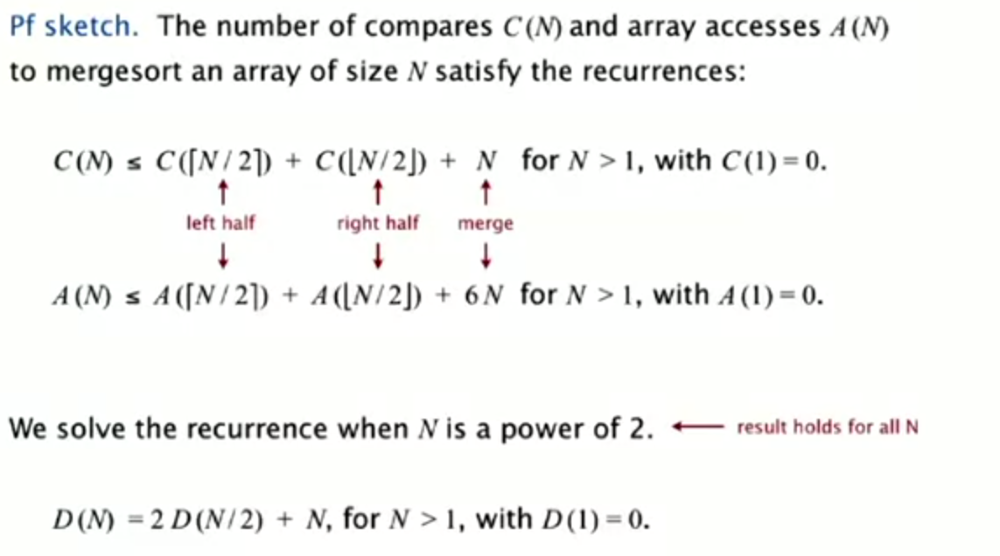

Here, it's very important that we consider that the algorithm access the array twice time when copy happends.


```java
private static void merge(Comparable[] a, Comparable[] aux, int lo, int mid, int hi){
    assert isSorted(a, lo, mid)
    assert isSorted(a, mid+1, hi);

    // copy access array 3N
    for(int k=lo;k<=hi;k++){
        aux[k] = a[k];
    }


    // merge access array 3N
    int i=lo,j=mid+1;
    for(int k=lo;k<=hi;k++){
        if(i>mid) a[k] = aux[j++];
        else if(j>hi) a[k] = aux[i++];
        else if (less(aux[j],aux[i])) a[k] = aux[j++]
        else a[k] = aux[i++];
    }
}
```

#### Pf1. [assuming $N$ is a power of 2]

**Proposition** if $D(N)$ satisfies $D(N)=2D(N/2)+N$ for $N>1$, with $D(1)=0$, then $D(N)=N\lg N$

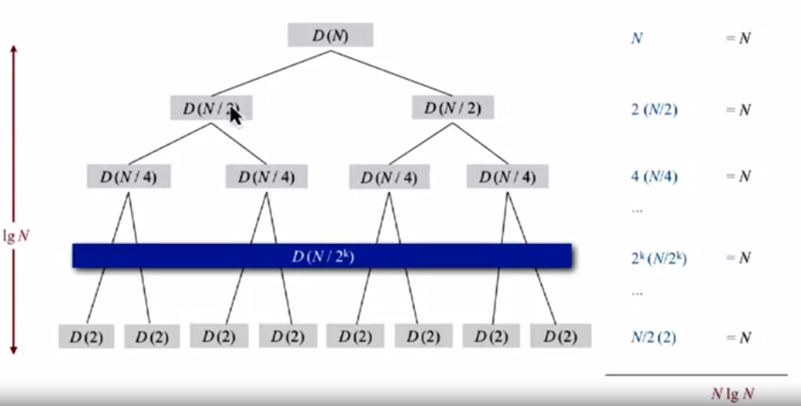

#### Pf2. proof by expansion

**Proposition** if $D(N)$ satisfies $D(N)=2D(N/2)+N$ for $N>1$, with $D(1)=0$, then $D(N)=N\lg N$

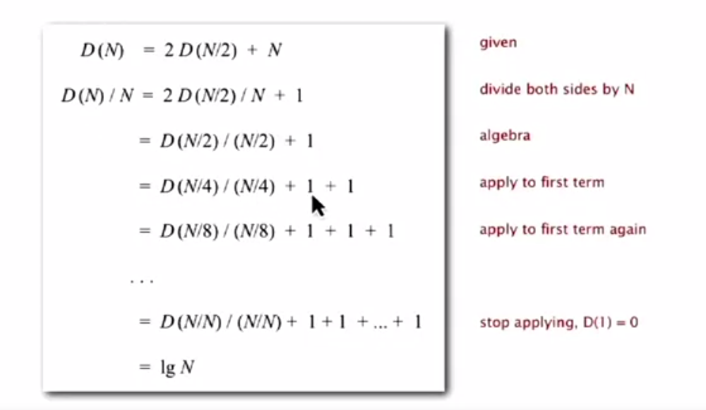

#### Pf3. proof by induction

**Proposition** if $D(N)$ satisfies $D(N)=2D(N/2)+N$ for $N>1$, with $D(1)=0$, then $D(N)=N\lg N$


### Mergesort memory

**Proposition** Mergesort uses extra space proportional to $N$

**Pf** The array ```aux[]``` needs to be of size $N$ for the last merge.

**Def** A sorting algorithm is ```in-place``` if it uses $\leq \log N$ extra memory
* *Ex* Insertion sort, selection sort, shellsort.

Nowdays, we have some ```in-place``` mergesort algorithm theory, but it's too complex for practice.

### Mergesort improvements

#### Use insertion sort for small subarrays

Mergesort has too much overhead for tiny subarrays.

Cutoff to insertion sort for - 7 items

```java
private static void sort(Comparable[] a,Comparable[] aux, int lo, int hi){
    if(hi <= lo + CUTOFF -1){
        Insertion.sort(a,lo,hi);
        return;
    })
    int mid = lo + (hi - lo) / 2;
    sort(a, aux, lo, mid);
    sort(a, aux, mid+1, hi);
    merge(a, aux, lo, mid, hi);
}
```

This will improve about 20%

#### Stop if already sorted.

is biggest item in first half $\leq$ smallest item in second half?

Helps ofr partially-ordered arrays.


```java
private static void sort(Comparable[] a,Comparable[] aux, int lo, int hi){
    if (hi<=lo) return;
    int mid = lo + (hi-lo)/2;
    sort(a,aux,lo,mid);
    sort(a,aux,mid+1,hi);
    if(!less(a[mid+1],a[mid])) return;
    merge(a,aux,lo,mid,hi);
}
```

#### Eliminate the copy to the auxiliary array.

**Need to be reconsidered**

Save time but not spcae by switching the role of the input and auxiliary array in each recursive call

```java
private static void merge(Comparable[] a,Comparable[] aux,int lo, int mid, int hi){
    int i =lo, j= mid+1;
    for(int k=lo;k<=hi;k++){
        if(i>mid) aux[k] = a[j++];
        else if(j>hi) aux[k] = a[i++];
        else if(less(a[j],a[i])) aux[k] = a[j++];
        else aux[k] = a[i++];
    }
}

private static void sort(Comaprable[] a,Comparable[] aux,int lo,int hi){
    if(lo>=hi) return;
    int mid = lo + (hi-lo)/2;
    sort(aux,a,lo,mid);
    sort(aux,a,mid+1,hi);
    merge(a,aux,lo,mid,hi);
}

```

### Buttom-up Mergesort

**Basic plan**
* Pass through array, merging subarrays of size 1
* Repeat for subarrays of size 2,4,8

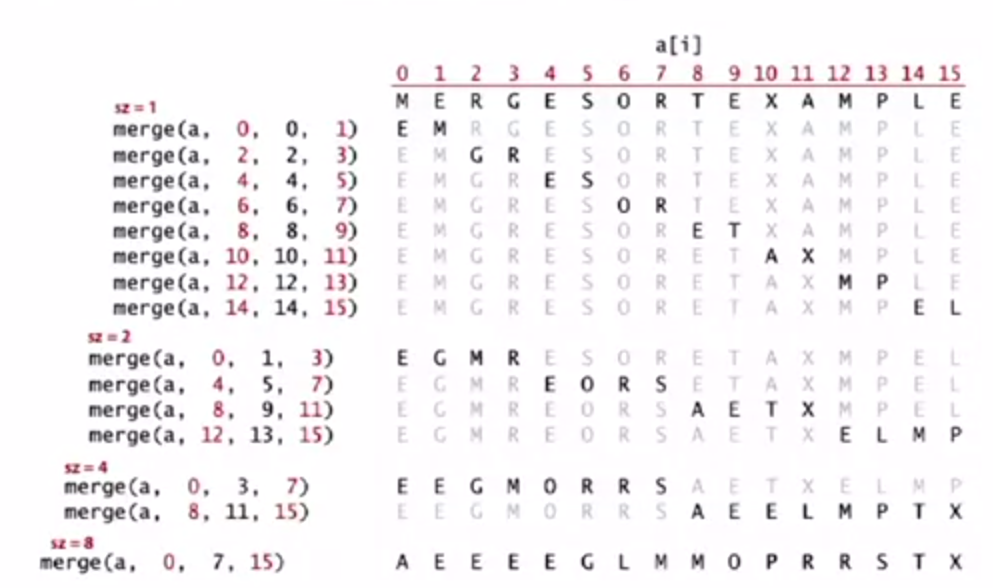

No recursion needed!

#### Java implementation

```java
public class MergeBU{
    private static Comparable[] aux;

    private static void merge(Comparable[] a,int lo, int mid, int hi){
        /* as before */
    }

    public static void sort(Comparable[] a){
        int N = a.length;
        aux = new Comparable[n];
        for(int sz = 1;sz< N; sz=sz+sz){
            // log N
            for(int lo=0;lo<N-sz;lo+=sz+sz){
                merge(a,lo,lo+sz-1,Math.min(lo+sz+sz-1,N-1));
            }
        }
    }
}
```

## Complexity of sorting

This analysis will help us to design a good algorithm

**Computational complexity** Framework to study efficiency of algorithms for solving a particular problem $X$

**Model of computation** Allowable operations

**Cost model** Operation count(s)

**Upper bound** COst guarantee provided by some algorithm for **X**

**Lower bound** Proven limit on cost guarantee of all algorithm for $X$

**Optimal algorithm** Algorithm with best possible cost guarantee for $X$

### Example -Sorting

* Model of computation: descision tree
* Cost model: compares
* Upper bound: $\sim N \lg N$ from mergesort
* Lower bound: ?
* Optimal algorithm: ?

#### Decision tree for 3 distinct item

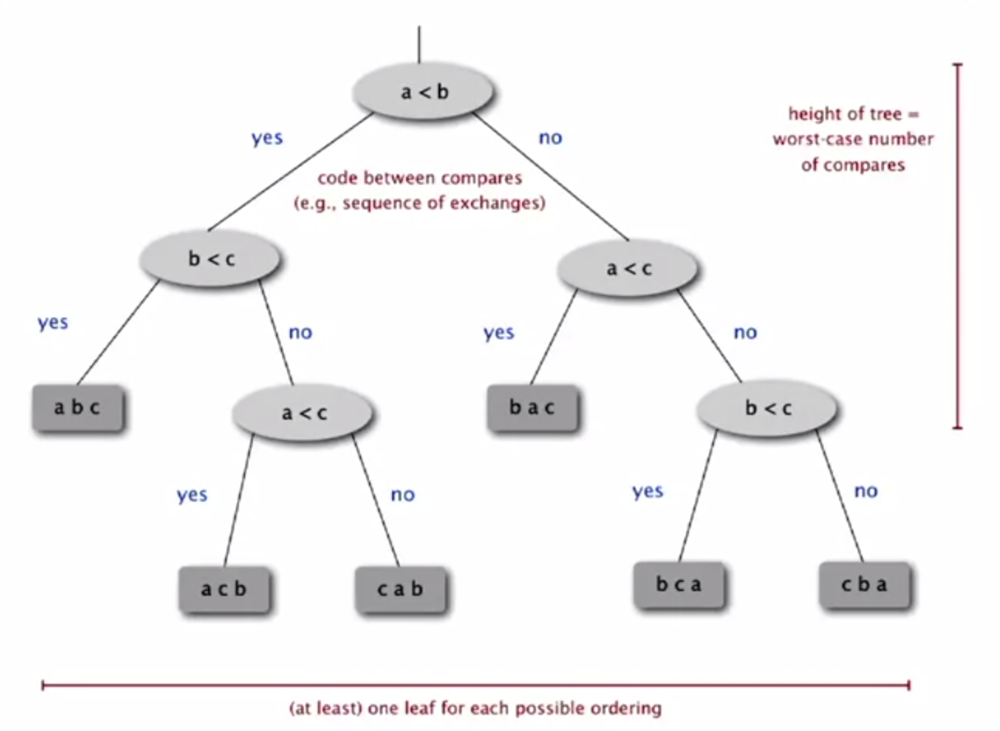

#### Compare-based lower bound of sorting

**Proposition** Any compare-based sorting algorithm must use at least $\lg(N!) \sim N\lg N$ compares in the worst-case

**Pf**
* Assume array consists of $N$ distinct values $a_1$ throught $a_N$
* Worst case dictated by height $h$ of decision tree
* Binary tree of height $h$ has at most $2^h$ leaves
* $N!$ different orderings $\rightarrow$ at least $N!$ leaves.


$2^{h} \geq leaves \geq N!$

$\rightarrow h \geq \lg(N!) \sim N\lg N$

Then 

* Model of computation: descision tree
* Cost model: compares
* Upper bound: $\sim N \lg N$ from mergesort
* Lower bound: $\sim N \lg N$
* Optimal algorithm: mergesort

**First goal of algorithm design** optimal algorithms

### Complexity results in context

**Compares** Mergesort is optimal with respect ot compares

**Space** Mergesort is not optimal with respect to space usage

**Lessons** Use theoty as a guide
* *Ex* don't try to design sorting algorithm that guarantees $1/2 N\lg N$ compares
* *Ex* design sorting algorithm that is both time- and space-optimal

### Complexity results in context (cont)

Lower bound may not hold if the alogrithm has information about:
* The initial order of the input
* The distribution of key values
* The representation of the keys

**Partially-ordered arrays** Depending on the initial order of the input, we may not need $N \lg N$ compares(Insertion sort requires only $N-1$ compares if input array is sorted)

**Duplicate keys** Depending on the initial order of the input, we may not need $N \lg N$ compares(3-way quicksort)

**Digital properties of keys** We can use digit/character compares instead of key comapres for numbers and strings. (Radix sorts)

## Comparator

### Comparable interface review

```java
public class Date implements Comparable<Date>{
    private final int month, day, year;

    public Date(int m, int d, int y){
        month = m;
        day = d;
        year = y;
    }
    ...
    public int compareTo(Date that){
        ...
    }
}
```

### Comparator

```java
public interface Comparator<Key>
    int compare(Key v,Key w)
```

To implement a comparator:
* Define a class that implements the ```Comparator``` interface
* Implement the ```compare()``` method.

```java
public class Student{
    public static final Comarator<Student> BY_NAME = new ByName();
    private final String name;
    private final int section;

    ...

    private static class ByName implements Comparator<Stduent>{
        public int compare(Student v, Student w){
            return v.name.compareTo(w.name)
        }
    }
}

Array.sort(a,Student.BY_NAME); // we can use in this way
```

## Stability

**Which sorts are stable?**
* Insertion sort and mergesort (But not selection sort or shellsort)

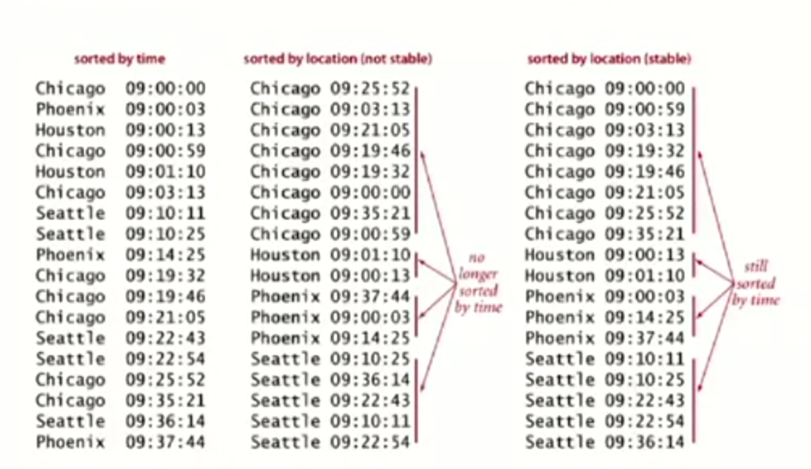

Need to be carefully check code ("less than" vs "less than or equal to")

**How to check if stable?**

Equal item never move pass each other

### Insertion sort

it's stable


### Selection sort

it's not stable

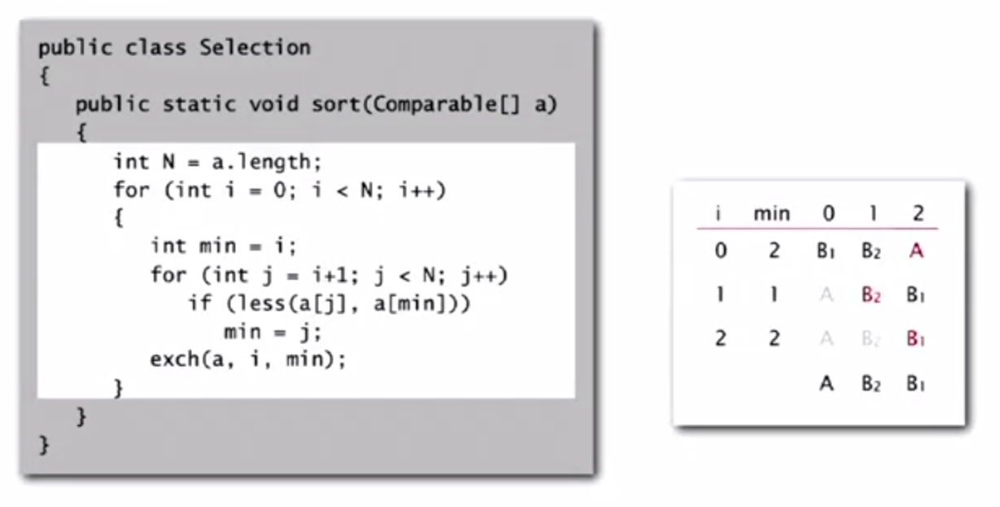

Long-distance exchange might move an item past some equal item

### Shell sort

it's not stable

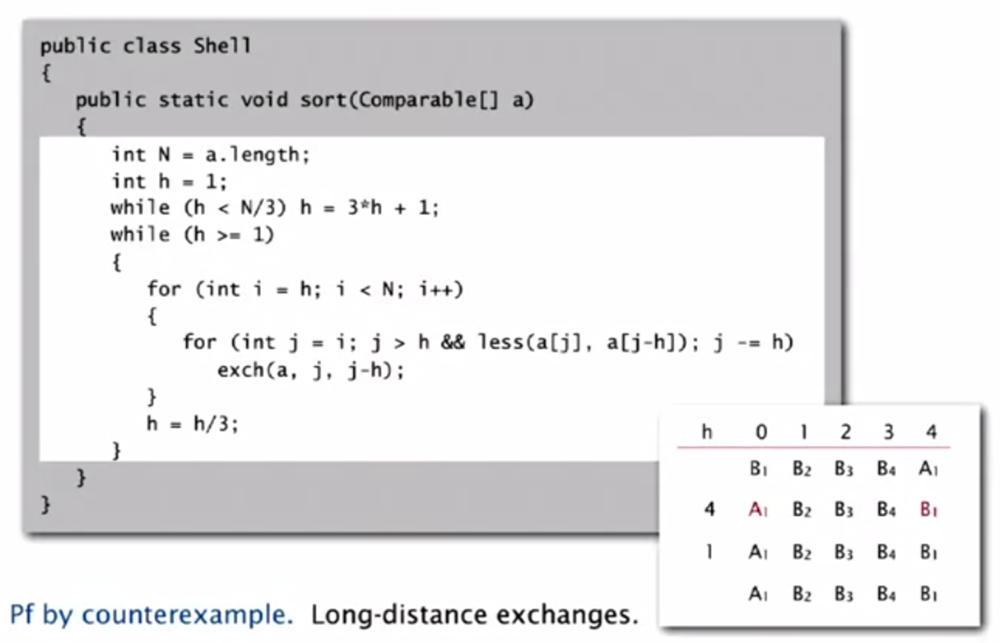

### Merge sort

it's stable depends on how we implement it

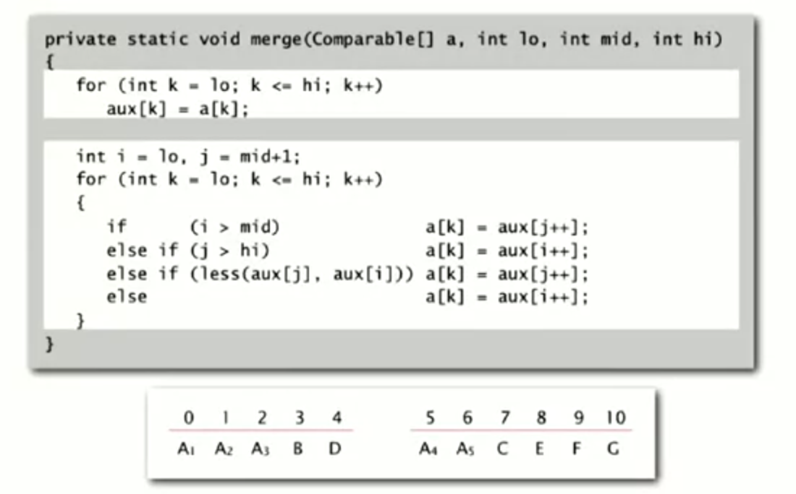

**Note** Take from left subarray if equal keys.

## Quicksort 

**Basic plan**
* *Shuffle* the array
* *Partition* so that, for some $j$
  * entry```a[j]``` is in place
  * no larger entry to the left of ```j```
  * no smaller entry to the right of ```j```
* *Sort* each piece recursively

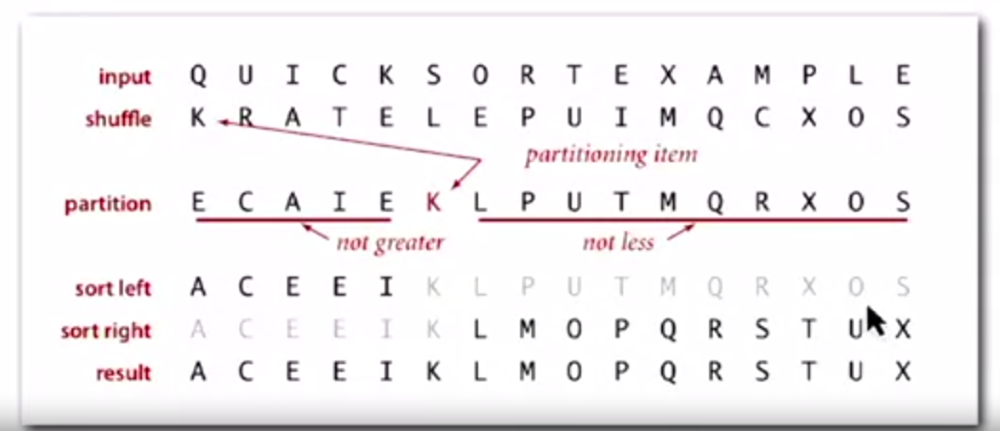

### Partitioning

**Phase 1** Repeat until ```i``` and ```j``` pointer cross
* Scan ```i``` from left to right so long as (```a[i]```<```a[lo]```)
* Scan ```j``` from right to left so long as (```a[j]``` > ```a[lo]```)
* Exchange ```a[i]``` with ```a[j]```

**Phase 2** When pointer cross
* Exchange ```a[lo]```with ```a[j]```

#### Java code

```java
private static int partition(Comparable[] a,int lo, int hi){
    int i = lo, j= hi;
    while(true){
        // find item on left to swap
        while(less(a[++i],a[lo])){
            if(i==hi)break;
        }

        // find item on right to swap
        while(less(a[lo],a[--j])){
            if(j==lo) break;
        }

        // check if pointers cross
        if(i>=j) break;

        exch(a,i,j);
    }
    // swap with partitioning item
    exch(a,lo,j);
    return j; 
}
```


### Quicksort Java Implementation

```java
public class Quick{
    private static int partition(Comparable[] a,int lo, int hi){ /* as before */}

    public static void sort(Comparable[] a){
        // shuffle needed for performance guarantee
        StdRandom.shuffle(a);
        sort(a,0,a.length-1);
    }

    private static void sort(Comparable[] a,int lo,int hi){
        if(hi<=lo) return;
        int j= partition(a,lo,hi);
        sort(a,lo,j-1);
        sort(a,j+1,hi);
    }
}
```

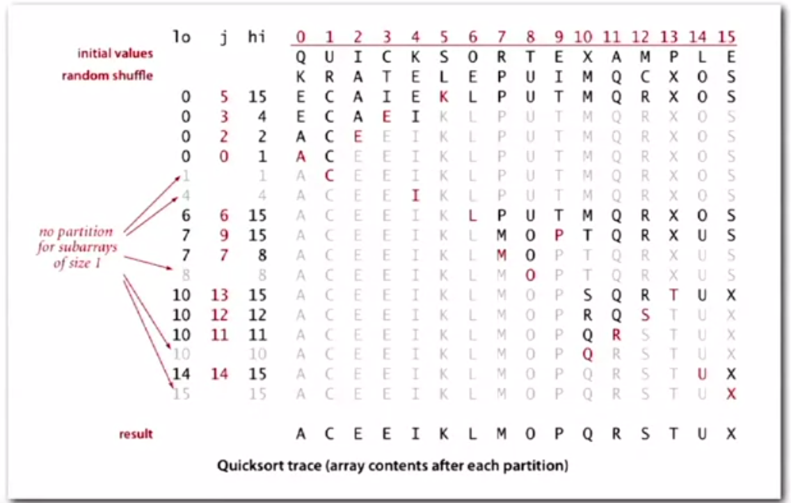

#### Implementation details

**Partitioning in-place** Using an extra array makes partitioning easier and stable, but is not worth the cost.

**Terminating the loop** Testing whether the pointers cross is a bit trickier than it might seem

**Staying in bounds** The (j==lo) test is redundant, but the (i==hi) test is not. This is because ```j``` will never cross the ```lo```. We use the ```a[lo]``` as our partition compare element.

**Preserving randomness** Shuffling is needed for performance guarantee.

**Equal keys** When duplicates are present, it is better to stop on keys equal to the partitioning item's key.

### Empirical analysis


#### Average-case analysis


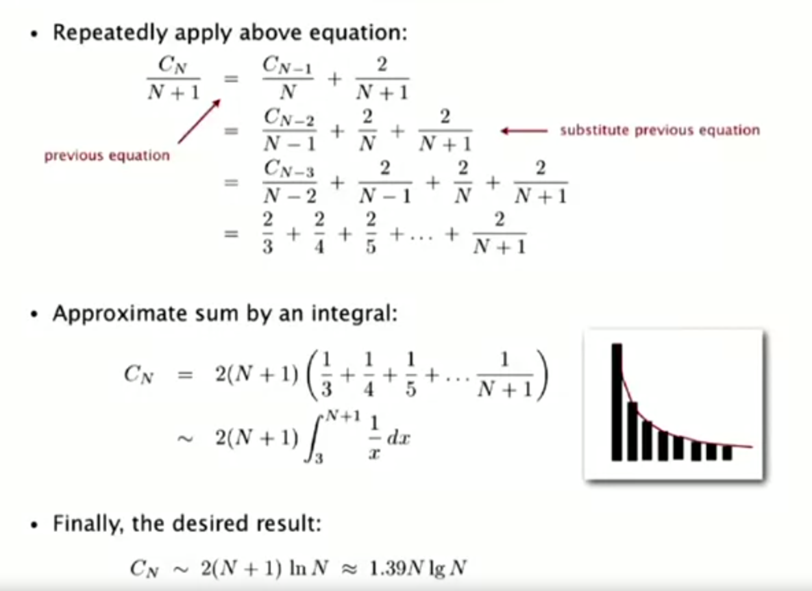

### Summary for performance

**Worst case** Number of compares is quadratic
* $N+(N-1)+...+1 \sim 1/2N^2$

**Average case** Number of compares is $\sim 1.39 N \lg N$
* 39% more compares than mergesort
* But faster thant mergesort in practice because of less data movement

**Random shuffle**
* Probabilistic guarantee against worst case.
* Basis for math model that can be validated with experiments

**Caveat emptor** Many textbook implementations go quadratic if array
* Is sorted or reverse sorted
  * Random shuffle inside it is not good enough
* Has many duplicates(even if randomized)
  * The end condition for duplicates key is not good enough

### Quicksort properties

**Proposition** Quicksort is an in-place sorting algorithm

**Pf**
* Partitioning: constant extra space
* Depth of recursion: logarithmic extra space (with high probility)

**Proposition** Quicksort is not stable

### Practical improvement


#### Insertion sort small subarrays

* Even quicksort has too much overhead for timy subarrays
* Cutoff to insertion sort for no more than 10 items
* Could delay insertion sort until one pass at end.

```java
private static void sort(Comparable[] a,int lo,int hi){
    if(hi<=lo+CUTOFF-1){
        Insertion.sort(a,lo,hi);
        return;
    }
    int j = partition(a,lo,hi);
    sort(a,lo,j-1);
    sort(a,j+1,hi);
}
```

#### Median of sample

* Best choice of pivot item = median
* Estimate true median by taking median of sample
* Median-of-3 item

```java
private static void sort(Comparable[] a,int lo, int hi){
    if(hi<=lo) return;

    int m = medianOf3(a,lo,lo+(hi-lo)/2, hi);
    swap(a,lo,m);

    int j = partition(a, lo, hi);
    sort(a,lo,j-1);
    sort(a,j+1,hi);
}
```

### Selection problem

**Goal** Given an array of $N$ items, find the $K^{th}$ largest

**Application**
* Order statistics
* Find the "top K"

**Use theory as a guide**
* Easy $N \lg N$ upper bound.
  * Sort first then find the $k^{th}$
* Easy $N$ upper bound for k=1,2,3
* Easy $N$ lower bound

#### Quick-select

**Partition array so that**
* Entry ```a[j]``` is in place
* No larger entry to the left of ```j```
* No smaller entry to the right of ```j```

**Repeat** in on subarray, depending on ```j```; finished when ```j``` equals ```k```

```java
public static Comparable select(Comparable[] a,int k){
    StdRandom.shuffle(a);
    int lo=0,hi=a.length-1;
    while(lo<hi){
        int j = partition(a,lo,hi);
        if(j<k) lo=j+1;
        else if(j>k) hi = j-1;
        else return a[k];
    }
    return a[k];
}
```

#### Quick-selection analysis


### Duplicate keys

**Mergesort with duplicate keys** Always between $1/2 N \lg N$ and $N \lg N$ compares

**Quicksort with duplicate keys**
* Algorithm goes quadratic unless partitioning stops on equal keys

**Mistake** Put all items equal to the partitioning item on one side.

**Comsequence** $\sim 1/2 N^2$ compares when all keys equal

**Recommended** Stop scans on items equal to the partitioning item.

**Comsequence** $\sim N \lg N$ compares when all keys equal

**Desirable** Put all items equal to the partitioning item in place

#### 3-way partitioning

**Goal** Partition array into 3 parts so that:
* Entries between ```lt``` and ```gt``` equal to partition item ```v```
* No larger entries to left of ```lt```
* No smaller entries to right of ```gt```


* Let ```v``` be partitioning item ```a[lo]```
* Scan ```i``` from left to right
  * ```a[i]``` < ```v```: exchange ```a[lt]``` with ```a[i]```; increment both ```lt``` and ```i```
  * ```a[i]``` < ```v```: exchange ```a[gt]``` with ```a[i]```; decrement ```gt```
  * ```a[i]``` = ```v```: increment ```i```

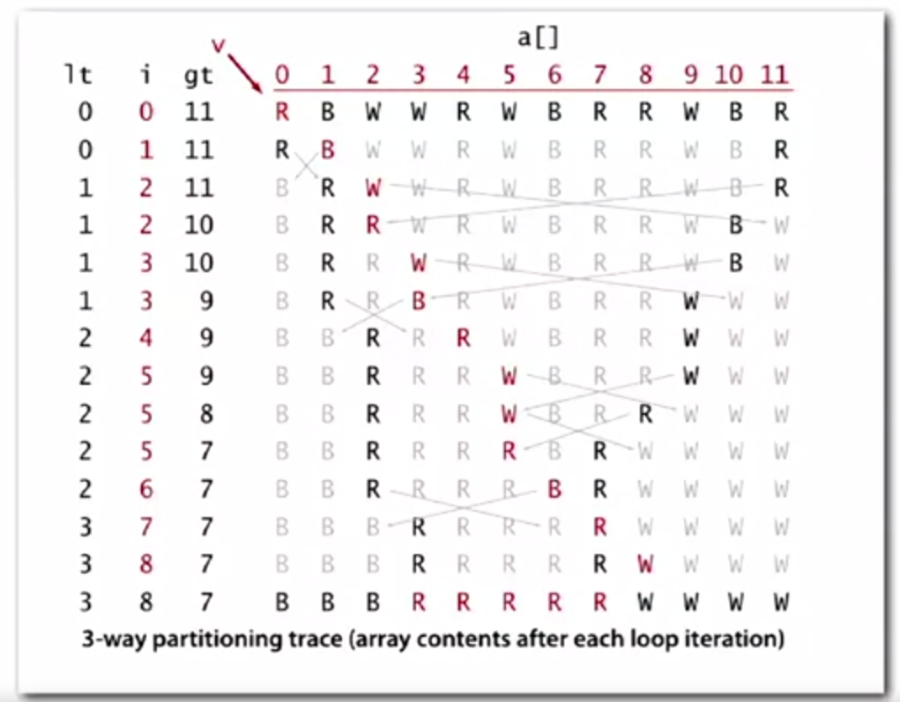

#### Java Implementation

```java
private static void sort(Comparable[] a,int lo, int hi){
    if(hi<=lo) return;
    int lt=lo, gt=hi;
    Comparable v = a[lo];
    int i=lo;
    while(i<=gt){
        int cmp = a[i].compareTo(v);
        if (cmp <0) exch(a,lt++,i++);
        else if(cmp >0) exch(a,i,gt--);
        else i++;
    }

    sort(a,lo,lt-1);
    sort(a,gt+1,hi);
}
```

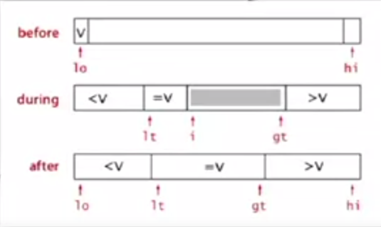

#### Lower bound

**Sorting lower bound** If there are $n$ distinct keys and the $i^{th}$ one occurs $x_i$ times, any compare-based sorting algorithm must use at least.

$\lg \frac{N!}{x_1!x_2!...x_n!} \sim -\sum_{i=1}^{n} x_i \lg \frac{x_i}{N}$

compares in the worst case.

$n \lg N$ when all distinct;

**Bootom line** Randomized quicksort with 3-way partitioning reduces running time from linearithmic to linear in broad class of application.

## Sorting application

### Java system sorts

**```Array.sort()```** 
* Has different method for each primitive type
* Has a method for data types that implement ```Comparable```
* Has a method that uses a ```Comparator```
* Uses tuned quicksort for primitive types; tuned mergesort for objects.
  * This is because if user choose to use primitive type, the performance maybe the most important factor.

### Engineering Sort

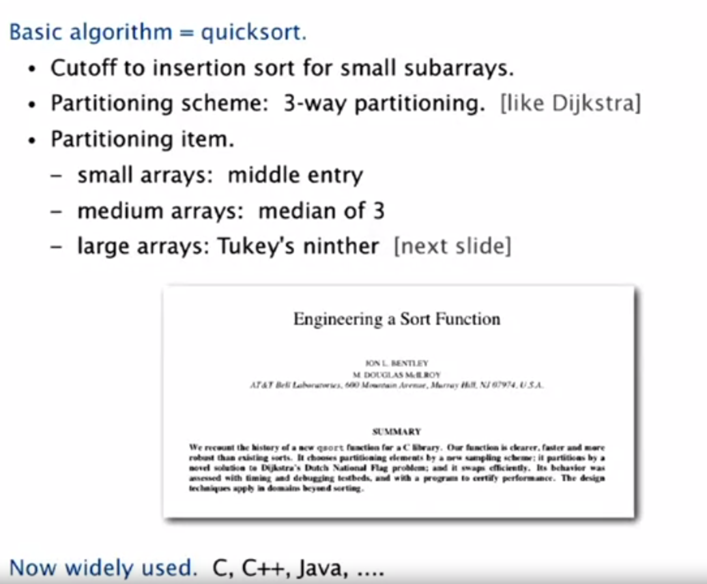

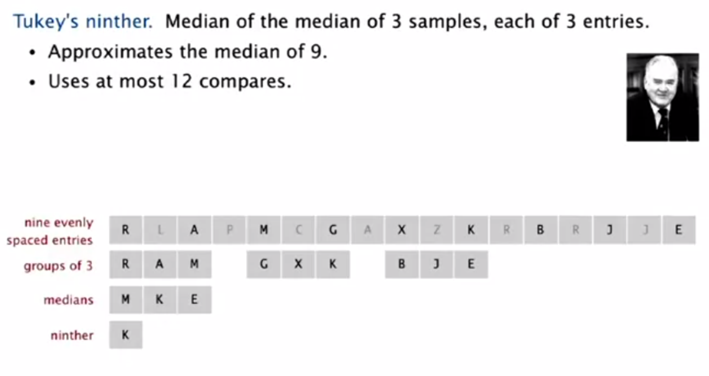

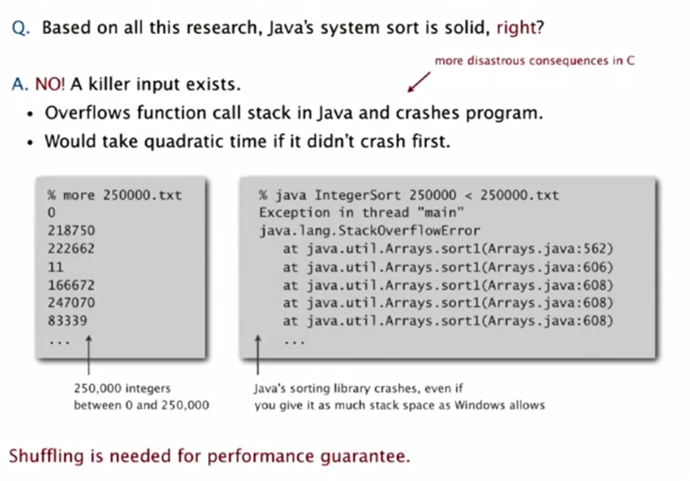


### Summarize for sort algorithm

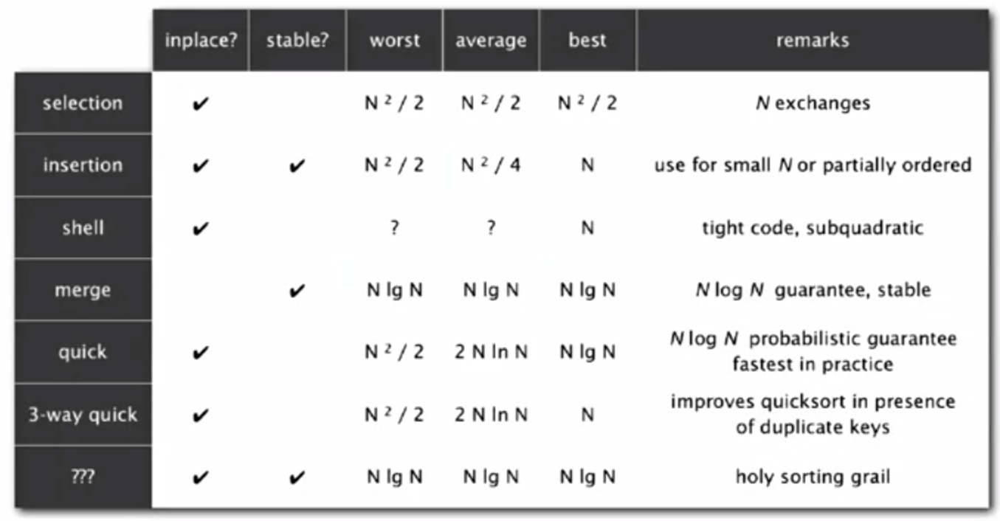

In practice, we should consider the attributes that the system needs. This will let us choose a more suitable algorithm for our system.