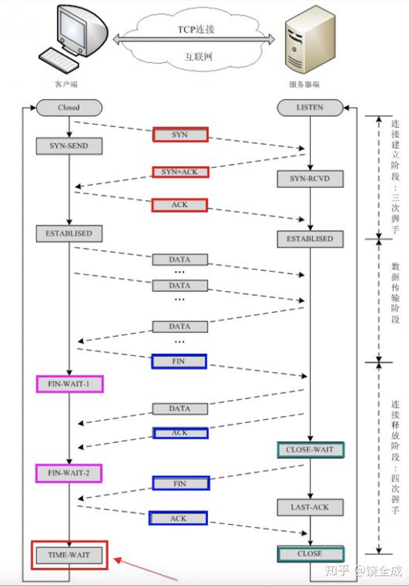
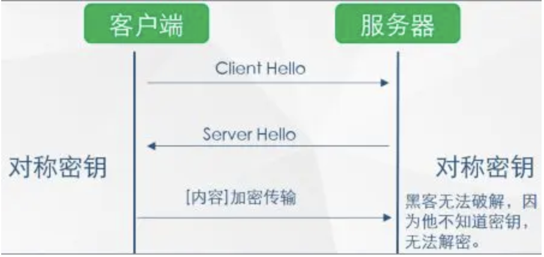
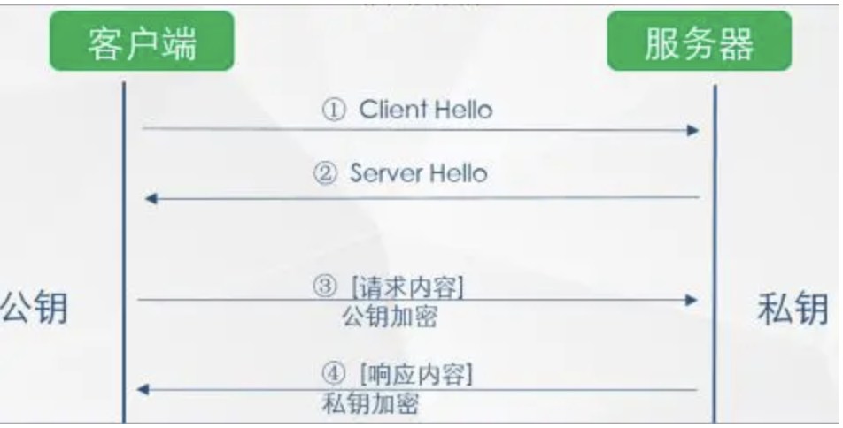
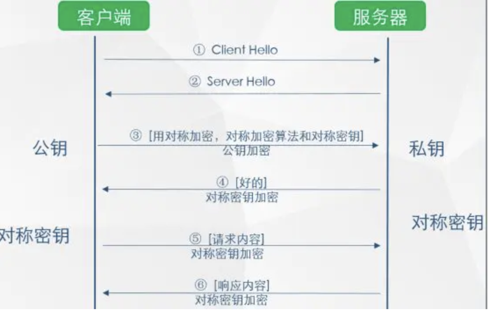
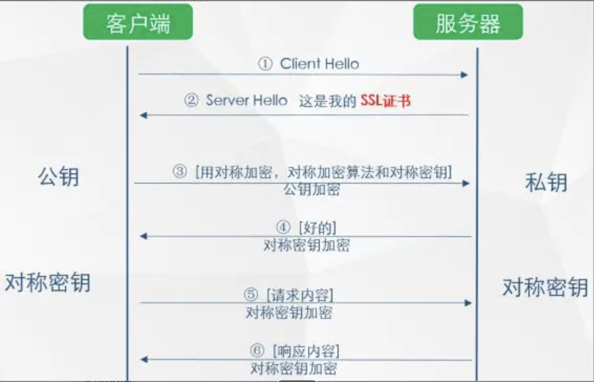

# HTTP 协议 <!-- omit in toc -->

、- [web始祖HTTP](#web始祖http)
  - [TCP 三次握手和四次挥手](#tcp-三次握手和四次挥手)
- [web始祖HTTP](#web始祖http)
  - [TCP 三次握手和四次挥手](#tcp-三次握手和四次挥手)
    - [三次握手](#三次握手)
    - [四次挥手](#四次挥手)
    - [进阶流程解释](#进阶流程解释)
      - [三次握手](#三次握手-1)
      - [为什么TCP客户端最后还要发送一次确认呢？](#为什么tcp客户端最后还要发送一次确认呢)
      - [四次挥手](#四次挥手-1)
- [HTTP与现代化浏览器](#http与现代化浏览器)
- [HTTP的基本优化](#http的基本优化)
  - [带宽](#带宽)
  - [延迟](#延迟)
- [HTTP的请求方法](#http的请求方法)
  - [幂等操作](#幂等操作)
  - [GET](#get)
  - [HEAD](#head)
  - [POST](#post)
  - [POST 和 GET的区别](#post-和-get的区别)
  - [PUT](#put)
  - [DELETE](#delete)
  - [CONNECT](#connect)
  - [OPTIONS](#options)
  - [TRACE](#trace)
  - [HTTP/1.1之后增加的方法](#http11之后增加的方法)
- [HTTP1.0和HTTP1.1的一些区别](#http10和http11的一些区别)
- [HTTP1.0和1.1现存的一些问题](#http10和11现存的一些问题)
- [HTTPS应声而出](#https应声而出)
  - [HTTPS 的基础](#https-的基础)
  - [HTTP 向 HTTPS 演化的过程](#http-向-https-演化的过程)
- [SSL/TLS 握手机制概述](#ssltls-握手机制概述)
  - [基本的运行过程](#基本的运行过程)
    - [如何保证公钥不被篡改？](#如何保证公钥不被篡改)
    - [公钥加密计算量太大，如何减少耗用的时间？](#公钥加密计算量太大如何减少耗用的时间)
  - [握手阶段的详细过程](#握手阶段的详细过程)
    - [客户端发出请求（ClientHello）](#客户端发出请求clienthello)
    - [服务器回应（SeverHello）](#服务器回应severhello)
    - [客户端回应](#客户端回应)
    - [服务器的最后回应](#服务器的最后回应)
- [HTTPS与HTTP的一些区别](#https与http的一些区别)
- [HTTPS改造](#https改造)
- [使用SPDY加快你的网站速度](#使用spdy加快你的网站速度)
- [HTTP2.0的前世今生](#http20的前世今生)
- [HTTP2.0的新特性](#http20的新特性)
- [HTTP2.0的升级改造](#http20的升级改造)
- [Reference](#reference)

## web始祖HTTP
全称：超文本传输协议(HyperText Transfer Protocol) 伴随着计算机网络和浏览器的诞生，HTTP1.0也随之而来，处于计算机网络中的应用层，HTTP是建立在TCP协议之上，所以HTTP协议的瓶颈及其优化技巧都是基于TCP协议本身的特性，例如tcp建立连接的3次握手和断开连接的4次挥手以及每次建立连接带来的RTT延迟时间。

### TCP 三次握手和四次挥手



其实3次握手的目的并不只是让通信双方都了解到一个连接正在建立，还在于利用数据包的选项来传输特殊的信息，交换初始序列号ISN。

3次握手是指发送了3个报文段，4次挥手是指发送了4个报文段。注意，SYN和FIN段都是会利用重传进行可靠传输的。

#### 三次握手

换个易于理解的视角来看为什么要3次握手。

客户端和服务端通信前要进行连接，“3次握手”的作用就是双方都能明确自己和对方的收、发能力是正常的。

第一次握手：客户端发送网络包，服务端收到了。这样服务端就能得出结论：客户端的发送能力、服务端的接收能力是正常的。

第二次握手：服务端发包，客户端收到了。这样客户端就能得出结论：服务端的接收、发送能力，客户端的接收、发送能力是正常的。 从客户端的视角来看，我接到了服务端发送过来的响应数据包，说明服务端接收到了我在第一次握手时发送的网络包，并且成功发送了响应数据包，这就说明，服务端的接收、发送能力正常。而另一方面，我收到了服务端的响应数据包，说明我第一次发送的网络包成功到达服务端，这样，我自己的发送和接收能力也是正常的。

第三次握手：客户端发包，服务端收到了。这样服务端就能得出结论：客户端的接收、发送能力，服务端的发送、接收能力是正常的。 第一、二次握手后，服务端并不知道客户端的接收能力以及自己的发送能力是否正常。而在第三次握手时，服务端收到了客户端对第二次握手作的回应。从服务端的角度，我在第二次握手时的响应数据发送出去了，客户端接收到了。所以，我的发送能力是正常的。而客户端的接收能力也是正常的。

经历了上面的三次握手过程，客户端和服务端都确认了自己的接收、发送能力是正常的。之后就可以正常通信了。

每次都是接收到数据包的一方可以得到一些结论，发送的一方其实没有任何头绪。我虽然有发包的动作，但是我怎么知道我有没有发出去，而对方有没有接收到呢？

而从上面的过程可以看到，最少是需要三次握手过程的。两次达不到让双方都得出自己、对方的接收、发送能力都正常的结论。其实每次收到网络包的一方至少是可以得到：对方的发送、我方的接收是正常的。而每一步都是有关联的，下一次的“响应”是由于第一次的“请求”触发，因此每次握手其实是可以得到额外的结论的。比如第三次握手时，服务端收到数据包，表明看服务端只能得到客户端的发送能力、服务端的接收能力是正常的，但是结合第二次，说明服务端在第二次发送的响应包，客户端接收到了，并且作出了响应，从而得到额外的结论：客户端的接收、服务端的发送是正常的。

#### 四次挥手

TCP连接是双向传输的对等的模式，就是说双方都可以同时向对方发送或接收数据。当有一方要关闭连接时，会发送指令告知对方，我要关闭连接了。这时对方会回一个ACK，此时一个方向的连接关闭。但是另一个方向仍然可以继续传输数据，等到发送完了所有的数据后，会发送一个FIN段来关闭此方向上的连接。接收方发送ACK确认关闭连接。注意，接收到FIN报文的一方只能回复一个ACK, 它是无法马上返回对方一个FIN报文段的，因为结束数据传输的“指令”是上层应用层给出的，我只是一个“搬运工”，我无法了解“上层的意志”。

这是因为服务端在LISTEN状态下，收到建立连接请求的SYN报文后，把ACK和SYN放在一个报文里发送给客户端。而关闭连接时，当收到对方的FIN报文时，仅仅表示对方不再发送数据了但是还能接收数据，己方是否现在关闭发送数据通道，需要上层应用来决定，因此，己方ACK和FIN一般都会分开发送。

#### 进阶流程解释

##### 三次握手


1. TCP服务器进程先创建传输控制块TCB，时刻准备接受客户进程的连接请求，此时服务器就进入了LISTEN（监听）状态；
1. TCP客户进程也是先创建传输控制块TCB，然后向服务器发出连接请求报文，这是报文首部中的同部位SYN=1，同时选择一个初始序列号 seq=x ，此时，TCP客户端进程进入了 SYN-SENT（同步已发送状态）状态。TCP规定，SYN报文段（SYN=1的报文段）不能携带数据，但需要消耗掉一个序号。
1. TCP服务器收到请求报文后，如果同意连接，则发出确认报文。确认报文中应该 ACK=1，SYN=1，确认号是ack=x+1，同时也要为自己初始化一个序列号 seq=y，此时，TCP服务器进程进入了SYN-RCVD（同步收到）状态。这个报文也不能携带数据，但是同样要消耗一个序号。
1. TCP客户进程收到确认后，还要向服务器给出确认。确认报文的ACK=1，ack=y+1，自己的序列号seq=x+1，此时，TCP连接建立，客户端进入ESTABLISHED（已建立连接）状态。TCP规定，ACK报文段可以携带数据，但是如果不携带数据则不消耗序号。
1. 当服务器收到客户端的确认后也进入ESTABLISHED状态，此后双方就可以开始通信了。

##### 为什么TCP客户端最后还要发送一次确认呢？

一句话，主要防止已经失效的连接请求报文突然又传送到了服务器，从而产生错误。

如果使用的是两次握手建立连接，假设有这样一种场景，**客户端发送了第一个请求连接并且没有丢失，只是因为在网络结点中滞留的时间太长了**，由于TCP的客户端迟迟没有收到确认报文，以为服务器没有收到，此时重新向服务器发送这条报文，此后客户端和服务器经过两次握手完成连接，传输数据，然后关闭连接。此时此前滞留的那一次请求连接，网络通畅了到达了服务器，这个报文本该是失效的，但是，两次握手的机制将会让客户端和服务器再次建立连接，这将导致不必要的错误和资源的浪费。

如果采用的是三次握手，就算是那一次失效的报文传送过来了，服务端接受到了那条失效报文并且回复了确认报文，但是客户端不会再次发出确认。由于服务器收不到确认，就知道客户端并没有请求连接。

##### 四次挥手


1. 客户端进程发出连接释放报文，并且停止发送数据。释放数据报文首部，FIN=1，其序列号为seq=u（等于前面已经传送过来的数据的最后一个字节的序号加1），此时，客户端进入FIN-WAIT-1（终止等待1）状态。 TCP规定，FIN报文段即使不携带数据，也要消耗一个序号。
1. 服务器收到连接释放报文，发出确认报文，ACK=1，ack=u+1，并且带上自己的序列号seq=v，此时，服务端就进入了CLOSE-WAIT（关闭等待）状态。TCP服务器通知高层的应用进程，客户端向服务器的方向就释放了，这时候处于半关闭状态，即客户端已经没有数据要发送了，但是服务器若发送数据，客户端依然要接受。这个状态还要持续一段时间，也就是整个CLOSE-WAIT状态持续的时间。
1. 客户端收到服务器的确认请求后，此时，客户端就进入FIN-WAIT-2（终止等待2）状态，等待服务器发送连接释放报文（在这之前还需要接受服务器发送的最后的数据）。
1. 服务器将最后的数据发送完毕后，就向客户端发送连接释放报文，FIN=1，ack=u+1，由于在半关闭状态，服务器很可能又发送了一些数据，假定此时的序列号为seq=w，此时，服务器就进入了LAST-ACK（最后确认）状态，等待客户端的确认。
1. 客户端收到服务器的连接释放报文后，必须发出确认，ACK=1，ack=w+1，而自己的序列号是seq=u+1，此时，客户端就进入了TIME-WAIT（时间等待）状态。注意此时TCP连接还没有释放，必须经过2∗*∗MSL（最长报文段寿命）的时间后，当客户端撤销相应的TCB后，才进入CLOSED状态。
1. 服务器只要收到了客户端发出的确认，立即进入CLOSED状态。同样，撤销TCB后，就结束了这次的TCP连接。可以看到，服务器结束TCP连接的时间要比客户端早一些。

## HTTP与现代化浏览器

早在HTTP建立之初，主要就是为了将超文本标记语言(HTML)文档从Web服务器传送到客户端的浏览器。也是说对于前端来说，我们所写的HTML页面将要放在我们的web服务器上，用户端通过浏览器访问url地址来获取网页的显示内容，但是到了WEB2.0以来，我们的页面变得复杂，不仅仅单纯的是一些简单的文字和图片，同时我们的HTML页面有了CSS，Javascript，来丰富我们的页面展示，当ajax的出现，我们又多了一种向服务器端获取数据的方法，这些其实都是基于HTTP协议的。同样到了移动互联网时代，我们页面可以跑在手机端浏览器里面，但是和PC相比，手机端的网络情况更加复杂，这使得我们开始了不得不对HTTP进行深入理解并不断优化过程中。

## HTTP的基本优化

影响一个HTTP网络请求的因素主要有两个：带宽和延迟。

### 带宽

如果说我们还停留在拨号上网的阶段，带宽可能会成为一个比较严重影响请求的问题，当时现在网络基础建设已经使得带宽得到极大的提升，我们不再会担心由带宽而影响网速，那么就只剩下延迟了。
### 延迟

1. **浏览器阻塞（HOL blocking）**：浏览器会因为一些原因阻塞请求。浏览器对于同一个域名，同时只能有 4 个连接（这个根据浏览器内核不同可能会有所差异），超过浏览器最大连接数限制，后续请求就会被阻塞。
2. **DNS 查询（DNS Lookup）**：浏览器需要知道目标服务器的 IP 才能建立连接。将域名解析为 IP 的这个系统就是 DNS。这个通常可以利用DNS缓存结果来达到减少这个时间的目的。
3. **建立连接（Initial connection）**：HTTP 是基于 TCP 协议的，浏览器最快也要在第三次握手时才能捎带 HTTP 请求报文，达到真正的建立连接，但是这些连接无法复用会导致每次请求都经历三次握手和慢启动。三次握手在高延迟的场景下影响较明显，**慢启动**则对文件类大请求影响较大。

## HTTP的请求方法

HTTP/1.1协议中共定义了8种HTTP请求方法，HTTP请求方法也被叫做“请求动作”，不同的方法规定了不同的操作指定的资源方式。服务端也会根据不同的请求方法做不同的响应。

### 幂等操作

一个HTTP方法是幂等的，指的是同样的请求被执行一次与连续执行多次的效果是一样的，服务器的状态也是一样的。换句话说就是，幂等方法不应该具有副作用（统计用途除外）。在正确实现的条件下，GET，HEAD，PUT和DELETE 等方法都是幂等的，而 POST 方法不是。所有的 safe 方法也都是幂等的。

幂等性只与后端服务器的实际状态有关，而每一次请求接收到的状态码不一定相同。例如，第一次调用DELETE 方法有可能返回 200，但是后续的请求可能会返回404。DELETE 的言外之意是，开发者不应该使用DELETE方法实现具有删除最后条目功能的 RESTful API。

### GET
GET请求会显示请求指定的资源。一般来说GET方法应该只用于数据的读取，而不应当用于会产生副作用的非幂等的操作中。

GET会方法请求指定的页面信息，并返回响应主体，GET被认为是不安全的方法，因为GET方法会被网络蜘蛛等任意的访问。

### HEAD
HEAD方法与GET方法一样，都是向服务器发出指定资源的请求。但是，服务器在响应HEAD请求时不会回传资源的内容部分，即：响应主体。这样，我们可以不传输全部内容的情况下，就可以获取服务器的响应头信息。HEAD方法常被用于客户端查看服务器的性能。

### POST
POST请求会 向指定资源提交数据，请求服务器进行处理，如：表单数据提交、文件上传等，请求数据会被包含在请求体中。POST方法是非幂等的方法，因为这个请求可能会创建新的资源或/和修改现有资源。

### POST 和 GET的区别

* GET 用于获取信息，是无副作用的，是幂等的，且可缓存
* POST 用于修改服务器上的数据，有副作用，非幂等，不可缓存

### PUT
PUT请求会身向指定资源位置上传其最新内容，PUT方法是幂等的方法。通过该方法客户端可以将指定资源的最新数据传送给服务器取代指定的资源的内容。

### DELETE
DELETE请求用于请求服务器删除所请求URI（统一资源标识符，Uniform Resource Identifier）所标识的资源。DELETE请求后指定资源会被删除，DELETE方法也是幂等的。

### CONNECT
CONNECT方法是HTTP/1.1协议预留的，能够将连接改为管道方式的代理服务器。通常用于SSL加密服务器的链接与非加密的HTTP代理服务器的通信。

### OPTIONS
OPTIONS请求与HEAD类似，一般也是用于客户端查看服务器的性能。 这个方法会请求服务器返回该资源所支持的所有HTTP请求方法，该方法会用'*'来代替资源名称，向服务器发送OPTIONS请求，可以测试服务器功能是否正常。JavaScript的XMLHttpRequest对象进行CORS跨域资源共享时，就是使用OPTIONS方法发送嗅探请求，以判断是否有对指定资源的访问权限。 允许

### TRACE
TRACE请求服务器回显其收到的请求信息，该方法主要用于HTTP请求的测试或诊断。

### HTTP/1.1之后增加的方法

在HTTP/1.1标准制定之后，又陆续扩展了一些方法。其中使用中较多的是 PATCH 方法：

PATCH  
PATCH方法出现的较晚，它在2010年的RFC 5789标准中被定义。PATCH请求与PUT请求类似，同样用于资源的更新。二者有以下两点不同：

* 但PATCH一般用于资源的部分更新，而PUT一般用于资源的整体更新。
* 当资源不存在时，PATCH会创建一个新的资源，而PUT只会对已在资源进行更新。

## HTTP1.0和HTTP1.1的一些区别

HTTP1.0最早在网页中使用是在1996年，那个时候只是使用一些较为简单的网页上和网络请求上，而HTTP1.1则在1999年才开始广泛应用于现在的各大浏览器网络请求中，同时HTTP1.1也是当前使用最为广泛的HTTP协议。 **主要区别主要体现在**：

1. **缓存处理**，在HTTP1.0中主要使用header里的If-Modified-Since,Expires来做为缓存判断的标准，HTTP1.1则引入了更多的缓存控制策略例如Entity tag，If-Unmodified-Since, If-Match, If-None-Match等更多可供选择的缓存头来控制缓存策略。
2. **带宽优化及网络连接的使用**，HTTP1.0中，存在一些浪费带宽的现象，例如客户端只是需要某个对象的一部分，而服务器却将整个对象送过来了，并且不支持断点续传功能，HTTP1.1则在请求头引入了range头域，它允许只请求资源的某个部分，即返回码是206（Partial Content），这样就方便了开发者自由的选择以便于充分利用带宽和连接。
3. **错误通知的管理**，在HTTP1.1中新增了24个错误状态响应码，如409（Conflict）表示请求的资源与资源的当前状态发生冲突；410（Gone）表示服务器上的某个资源被永久性的删除。
4. **Host头处理**，在HTTP1.0中认为每台服务器都绑定一个唯一的IP地址，因此，请求消息中的URL并没有传递主机名（hostname）。但随着虚拟主机技术的发展，在一台物理服务器上可以存在多个虚拟主机（Multi-homed Web Servers），并且它们共享一个IP地址。HTTP1.1的请求消息和响应消息都应支持Host头域，且请求消息中如果没有Host头域会报告一个错误（400 Bad Request）。
5. **长连接**，HTTP 1.1支持长连接（PersistentConnection）和请求的流水线（Pipelining）处理，在一个TCP连接上可以传送多个HTTP请求和响应，减少了建立和关闭连接的消耗和延迟，在HTTP1.1中默认开启Connection： keep-alive，一定程度上弥补了HTTP1.0每次请求都要创建连接的缺点。以下是常见的HTTP1.0：

## HTTP1.0和1.1现存的一些问题

1. 上面提到过的，HTTP1.x在传输数据时，每次都需要重新建立连接，无疑增加了大量的延迟时间，特别是在移动端更为突出。
1. HTTP1.x在传输数据时，所有传输的内容都是明文，客户端和服务器端都无法验证对方的身份，这在一定程度上无法保证数据的安全性。
1. HTTP1.x在使用时，header里携带的内容过大，在一定程度上增加了传输的成本，并且每次请求header基本不怎么变化，尤其在移动端增加用户流量。
1. 虽然HTTP1.x支持了keep-alive，来弥补多次创建连接产生的延迟，但是keep-alive使用多了同样会给服务端带来大量的性能压力，并且对于单个文件被不断请求的服务(例如图片存放网站)，keep-alive可能会极大的影响性能，因为它在文件被请求之后还保持了不必要的连接很长时间。
 

## HTTPS应声而出

为了解决以上问题，网景在1994年创建了HTTPS，并应用在网景导航者浏览器中。 最初，HTTPS是与SSL一起使用的；在SSL逐渐演变到TLS时（其实两个是一个东西，只是名字不同而已），最新的HTTPS也由在2000年五月公布的RFC 2818正式确定下来。简单来说，HTTPS就是安全版的HTTP，并且由于当今时代对安全性要求更高，chrome和firefox都大力支持网站使用HTTPS，苹果也在ios 10系统中强制app使用HTTPS来传输数据，由此可见HTTPS势在必行。

### HTTPS 的基础

超文本传输安全协议（英语：Hypertext Transfer Protocol Secure，缩写：HTTPS，常称为HTTP over TLS，HTTP over SSL或HTTP Secure）是一种通过计算机网络进行安全通信的传输协议。HTTPS经由HTTP进行通信，但利用SSL/TLS来加密数据包。

### HTTP 向 HTTPS 演化的过程

第一步：为了防止上述现象的发生，人们想到一个办法：对传输的信息加密（即使黑客截获，也无法破解）



如上图所示，此种方式属于对称加密，双方拥有相同的密钥，信息得到安全传输，但此种方式的缺点是：
1. 不同的客户端、服务器数量庞大，所以双方都需要维护大量的密钥，维护成本很高
1. 因每个客户端、服务器的安全级别不同，密钥极易泄露

第二步：既然使用对称加密时，密钥维护这么繁琐，那我们就用非对称加密试试



如上图所示，客户端用公钥对请求内容加密，服务器使用私钥对内容解密，反之亦然，但上述过程也存在缺点：

1. 公钥是公开的（也就是黑客也会有公钥），所以第 ④ 步私钥加密的信息，如果被黑客截获，其可以使用公钥进行解密，获取其中的内容

第三步：非对称加密既然也有缺陷，那我们就将对称加密，非对称加密两者结合起来，取其精华、去其糟粕，发挥两者的各自的优势



如上图所示

2. 第 ③ 步时，客户端说：（咱们后续回话采用对称加密吧，这是对称加密的算法和对称密钥）这段话用公钥进行加密，然后传给服务器
2. 服务器收到信息后，用私钥解密，提取出对称加密算法和对称密钥后，服务器说：（好的）对称密钥加密
2. 后续两者之间信息的传输就可以使用对称加密的方式了

遇到的问题：

* 客户端如何获得公钥
* 如何确认服务器是真实的而不是黑客

第四步：获取公钥与确认服务器身份


1. 获取公钥

提供一个下载公钥的地址，回话前让客户端去下载。（缺点：下载地址有可能是假的；客户端每次在回话前都先去下载公钥也很麻烦）
回话开始时，服务器把公钥发给客户端（缺点：黑客冒充服务器，发送给客户端假的公钥）

2. 那有木有一种方式既可以安全的获取公钥，又能防止黑客冒充呢？ 那就需要用到终极武器了：

SSL 证书（申购)



如上图所示，在第 ② 步时服务器发送了一个SSL证书给客户端，SSL 证书中包含的具体内容有：
```
证书的发布机构CA
证书的有效期
公钥
证书所有者
签名
………
```

3. 客户端在接受到服务端发来的SSL证书时，会对证书的真伪进行校验，以浏览器为例说明如下：

   1. 首先浏览器读取证书中的证书所有者、有效期等信息进行一一校验
   2. 浏览器开始查找操作系统中已内置的受信任的证书发布机构CA，与服务器发来的证书中的颁发者CA比对，用于校验证书是否为合法机构颁发
   3. 如果找不到，浏览器就会报错，说明服务器发来的证书是不可信任的。
   4. 如果找到，那么浏览器就会从操作系统中取出 颁发者CA 的公钥，然后对服务器发来的证书里面的签名进行解密
   5. 浏览器使用相同的hash算法计算出服务器发来的证书的hash值，将这个计算的hash值与证书中签名做对比
   6. 对比结果一致，则证明服务器发来的证书合法，没有被冒充
   7. 此时浏览器就可以读取证书中的公钥，用于后续加密了
   8. 所以通过发送SSL证书的形式，既解决了公钥获取问题，又解决了黑客冒充问题，一箭双雕，HTTPS加密过程也就此形成


## SSL/TLS 握手机制概述

### 基本的运行过程

SSL/TLS协议的基本思路是采用公钥加密法，也就是说，客户端先向服务器端索要公钥，然后用公钥加密信息，服务器收到密文后，用自己的私钥解密。

但是，这里有两个问题。

#### 如何保证公钥不被篡改？

解决方法：将公钥放在数字证书中。只要证书是可信的，公钥就是可信的。

#### 公钥加密计算量太大，如何减少耗用的时间？

解决方法：每一次对话（session），客户端和服务器端都生成一个"对话密钥"（session key），用它来加密信息。由于"对话密钥"是对称加密，所以运算速度非常快，而服务器公钥只用于加密"对话密钥"本身，这样就减少了加密运算的消耗时间。

因此，SSL/TLS协议的基本过程是这样的：

1. 客户端向服务器端索要并验证公钥。
2. 双方协商生成"对话密钥"。
3. 双方采用"对话密钥"进行加密通信。

上面过程的前两步，又称为"握手阶段"（handshake）。

### 握手阶段的详细过程


"握手阶段"涉及四次通信，我们一个个来看。需要注意的是，"握手阶段"的所有通信都是明文的。

#### 客户端发出请求（ClientHello）

首先，客户端（通常是浏览器）先向服务器发出加密通信的请求，这被叫做ClientHello请求。

在这一步，客户端主要向服务器提供以下信息。

1. 支持的协议版本，比如TLS 1.0版。
2. 一个客户端生成的随机数，稍后用于生成"对话密钥"。
3. 支持的加密方法，比如RSA公钥加密。
4. 支持的压缩方法。

这里需要注意的是，客户端发送的信息之中不包括服务器的域名。也就是说，理论上服务器只能包含一个网站，否则会分不清应该向客户端提供哪一个网站的数字证书。这就是为什么通常一台服务器只能有一张数字证书的原因。

对于虚拟主机的用户来说，这当然很不方便。2006年，TLS协议加入了一个Server Name Indication扩展，允许客户端向服务器提供它所请求的域名。

#### 服务器回应（SeverHello）

服务器收到客户端请求后，向客户端发出回应，这叫做SeverHello。服务器的回应包含以下内容。

1. 确认使用的加密通信协议版本，比如TLS 1.0版本。如果浏览器与服务器支持的版本不一致，服务器关闭加密通信。
2. 一个服务器生成的随机数，稍后用于生成"对话密钥"。
3. 确认使用的加密方法，比如RSA公钥加密。
4. 服务器证书。

除了上面这些信息，如果服务器需要确认客户端的身份，就会再包含一项请求，要求客户端提供"客户端证书"。比如，金融机构往往只允许认证客户连入自己的网络，就会向正式客户提供USB密钥，里面就包含了一张客户端证书。

#### 客户端回应

客户端收到服务器回应以后，首先验证服务器证书。如果证书不是可信机构颁布、或者证书中的域名与实际域名不一致、或者证书已经过期，就会向访问者显示一个警告，由其选择是否还要继续通信。

如果证书没有问题，客户端就会从证书中取出服务器的公钥。然后，向服务器发送下面三项信息。

1. 一个随机数。该随机数用服务器公钥加密，防止被窃听。
2. 编码改变通知，表示随后的信息都将用双方商定的加密方法和密钥发送。
3. 客户端握手结束通知，表示客户端的握手阶段已经结束。这一项同时也是前面发送的所有内容的hash值，用来供服务器校验。

上面第一项的随机数，是整个握手阶段出现的第三个随机数，又称"pre-master key"。有了它以后，客户端和服务器就同时有了三个随机数，接着双方就用事先商定的加密方法，各自生成本次会话所用的同一把"会话密钥"。

至于为什么一定要用三个随机数，来生成"会话密钥"，dog250解释得很好：

"不管是客户端还是服务器，都需要随机数，这样生成的密钥才不会每次都一样。由于SSL协议中证书是静态的，因此十分有必要引入一种随机因素来保证协商出来的密钥的随机性。

对于RSA密钥交换算法来说，pre-master-key本身就是一个随机数，再加上hello消息中的随机，三个随机数通过一个密钥导出器最终导出一个对称密钥。

pre master的存在在于SSL协议不信任每个主机都能产生完全随机的随机数，如果随机数不随机，那么pre master secret就有可能被猜出来，那么仅适用pre master secret作为密钥就不合适了，因此必须引入新的随机因素，那么客户端和服务器加上pre master secret三个随机数一同生成的密钥就不容易被猜出了，一个伪随机可能完全不随机，可是是三个伪随机就十分接近随机了，每增加一个自由度，随机性增加的可不是一。"

此外，如果前一步，服务器要求客户端证书，客户端会在这一步发送证书及相关信息。

#### 服务器的最后回应

服务器收到客户端的第三个随机数pre-master key之后，计算生成本次会话所用的"会话密钥"。然后，向客户端最后发送下面信息。

1. 编码改变通知，表示随后的信息都将用双方商定的加密方法和密钥发送。
2. 服务器握手结束通知，表示服务器的握手阶段已经结束。这一项同时也是前面发送的所有内容的hash值，用来供客户端校验。

至此，整个握手阶段全部结束。接下来，客户端与服务器进入加密通信，就完全是使用普通的HTTP协议，只不过用"会话密钥"加密内容。

## HTTPS与HTTP的一些区别

1. HTTPS协议需要到ca申请证书，一般免费证书很少，需要交费。
1. HTTP是超文本传输协议，信息是明文传输，HTTPS 则是具有安全性的ssl加密传输协议。
1. HTTP和HTTPS使用的是完全不同的连接方式，用的端口也不一样，前者是80，后者是443。
1. HTTPS的连接很简单，HTTPS协议是由SSL+HTTP协议构建的可进行加密传输、身份认证的网络协议，比http协议安全。
 
## HTTPS改造

如果一个网站要全站由HTTP替换成HTTPS，可能需要关注以下几点：

1. 安装CA证书，一般的证书都是需要收费的，这边推荐一个比较好的购买证书网站：1）[Let’s Encrypt](https://www.google.com.hk/url?sa=t&rct=j&q=&esrc=s&source=web&cd=1&ved=0ahUKEwiR-aqIuonOAhVEJJQKHRUyB9kQFggcMAA&url=%68%74%74%70%73%3a%2f%2f%6c%65%74%73%65%6e%63%72%79%70%74%2e%6f%72%67%2f&usg=AFQjCNHLSK55fO3YLnyT_sYlhlFMyyILjg)，免费，快捷，支持多域名（不是通配符），三条命令即时签署+导出证书。缺点是暂时只有三个月有效期，到期需续签。2[Comodo PositiveSSL](http://www.googleadservices.com/pagead/aclk?sa=L&ai=DChcSEwiw__OzuonOAhWXl70KHckjAFwYABAA&ohost=www.google.cn&cid=CAASJORoai_i-_0j0yr7GaclkrgOrZjgeqXX5_EFZU_1oxVUunWc5A&sig=AOD64_2e98s_eLbDZ4LOE0bxIwoqy8RZ6g&q=&ved=0ahUKEwim1_GzuonOAhVLHZQKHf--BB4Q0QwIGg&adurl=)，收费，但是比较稳定。
1. 在购买证书之后，在证书提供的网站上配置自己的域名，将证书下载下来之后，配置自己的web服务器，同时进行代码改造。
1. HTTPS 降低用户访问速度。SSL握手，HTTPS 对速度会有一定程度的降低，但是只要经过合理优化和部署，HTTPS 对速度的影响完全可以接受。在很多场景下，HTTPS 速度完全不逊于 HTTP，如果使用 SPDY，HTTPS 的速度甚至还要比 HTTP 快。
1. 相对于HTTPS降低访问速度，其实更需要关心的是服务器端的CPU压力，HTTPS中大量的密钥算法计算，会消耗大量的CPU资源，只有足够的优化，HTTPS 的机器成本才不会明显增加。

推荐一则淘[宝网改造](http://velocity.oreilly.com.cn/2015/ppts/lizhenyu.pdf)HTTPS的文章。

## 使用SPDY加快你的网站速度

2012年google如一声惊雷提出了SPDY的方案，大家才开始从正面看待和解决老版本HTTP协议本身的问题，SPDY可以说是综合了HTTPS和HTTP两者有点于一体的传输协议，主要解决：

1. 降低延迟，针对HTTP高延迟的问题，SPDY优雅的采取了多路复用（multiplexing）。多路复用通过多个请求stream共享一个tcp连接的方式，解决了HOL blocking的问题，降低了延迟同时提高了带宽的利用率。
1. 请求优先级（request prioritization）。多路复用带来一个新的问题是，在连接共享的基础之上有可能会导致关键请求被阻塞。SPDY允许给每个request设置优先级，这样重要的请求就会优先得到响应。比如浏览器加载首页，首页的html内容应该优先展示，之后才是各种静态资源文件，脚本文件等加载，这样可以保证用户能第一时间看到网页内容。
1. header压缩。前面提到HTTP1.x的header很多时候都是重复多余的。选择合适的压缩算法可以减小包的大小和数量。
1. 基于HTTPS的加密协议传输，大大提高了传输数据的可靠性。
2. 服务端推送（server push），采用了SPDY的网页，例如我的网页有一个sytle.css的请求，在客户端收到sytle.css数据的同时，服务端会将sytle.js的文件推送给客户端，当客户端再次尝试获取sytle.js时就可以直接从缓存中获取到，不用再发请求了。

SPDY位于HTTP之下，TCP和SSL之上，这样可以轻松兼容老版本的HTTP协议(将HTTP1.x的内容封装成一种新的frame格式)，同时可以使用已有的SSL功能

## HTTP2.0的前世今生
S顾名思义有了HTTP1.x，那么HTTP2.0也就顺理成章的出现了。HTTP2.0可以说是SPDY的升级版（其实原本也是基于SPDY设计的），但是，HTTP2.0 跟 SPDY 仍有不同的地方，主要是以下两点：

1. HTTP2.0 支持明文 [HTTP](http://http2.github.io/http2-spec/compression.html) 传输，而 SPDY 强制使用 HTTPS
1. HTTP2.0 消息头的压缩算法采用 HPACK，而非 SPDY 采用的 [DEFLATE](http://zh.wikipedia.org/wiki/DEFLATE)
 

## HTTP2.0的新特性

1. **新的二进制格式（Binary Format）**，HTTP1.x的解析是基于文本。基于文本协议的格式解析存在天然缺陷，文本的表现形式有多样性，要做到健壮性考虑的场景必然很多，二进制则不同，只认0和1的组合。基于这种考虑HTTP2.0的协议解析决定采用二进制格式，实现方便且健壮。
2. **多路复用（MultiPlexing）**，即连接共享，即每一个request都是是用作连接共享机制的。一个request对应一个id，这样一个连接上可以有多个request，每个连接的request可以随机的混杂在一起，接收方可以根据request的 id将request再归属到各自不同的服务端请求里面。


1. **header压缩**，如上文中所言，对前面提到过HTTP1.x的header带有大量信息，而且每次都要重复发送，HTTP2.0使用encoder来减少需要传输的header大小，通讯双方各自cache一份header fields表，既避免了重复header的传输，又减小了需要传输的大小。
1. **服务端推送（server push）**，同SPDY一样，HTTP2.0也具有server push功能。目前，有大多数网站已经启用HTTP2.0，例如YouTuBe，淘宝网等网站，利用chrome控制台可以查看是否启用H2：

更多关于HTTP2的问题可以参考：[HTTP2奇妙日常](http://www.alloyteam.com/2015/03/http2-0-di-qi-miao-ri-chang/)，以及HTTP2.0的[官方网站](https://http2.akamai.com/)。

## HTTP2.0的升级改造

对比HTTPS的升级改造，HTTP2.0获取会稍微简单一些，你可能需要关注以下问题：

1. 前文说了HTTP2.0其实可以支持非HTTPS的，但是现在主流的浏览器像chrome，firefox表示还是只支持基于 TLS 部署的HTTP2.0协议，所以要想升级成HTTP2.0还是先生气HTTPS为好。
1. 当你的网站已经升级HTTPS之后，那么升级HTTP2.0就简单很多，如果你使用NGINX，只要在配置文件中启动相应的协议就可以了，可以参考[NGINX白皮书](https://www.nginx.com/wp-content/uploads/2015/09/NGINX_HTTP2_White_Paper_v4.pdf)，[NGINX配置HTTP2.0官方指南](https://www.nginx.com/blog/nginx-1-9-5/)。
1. 使用了HTTP2.0那么，原本的HTTP1.x怎么办，这个问题其实不用担心，HTTP2.0完全兼容HTTP1.x的语义，对于不支持HTTP2.0的浏览器，NGINX会自动向下兼容的。
 

后记
以上就是关于HTTP,HTTP2.0,SPDY,HTTPS的一些基本理论，有些内容没有深入讲解，大家可以跟进参考连接具体查看。
关于HTTP1.x的一些优化方式，例如文件合并压缩，资源cdn，js，css优化等等同样使用与HTTP2.0和HTTPS，所以web前端的优化，还是要继续进行。
其实WEB发展如此迅速的今天，有些技术是真的要与时俱进的，就像苹果宣布ios 10必须使用HTTPS开始，关于web协议革新就已经开始了，为了更好的性能，更优越的方式，现在就开始升级改造吧

## Reference

* [HTTP,HTTP2.0,SPDY,HTTPS看这篇就够了](https://www.nihaoshijie.com.cn/index.php/archives/630/)
* [两张动图-彻底明白TCP的三次握手与四次挥手](https://blog.csdn.net/qzcsu/article/details/72861891))
* [01_Http、Https、Http2.0 的基础知识总结（持续更新篇）
](https://www.jianshu.com/p/c4614464c3ef)
* [HTTP概述](https://developer.mozilla.org/zh-CN/docs/Web/HTTP/Overview)
* [HTTP请求方法：GET、HEAD、POST、PUT、DELETE、CONNECT、OPTIONS、TRACE](https://itbilu.com/other/relate/EkwKysXIl.html)
* [幂等](https://developer.mozilla.org/zh-CN/docs/Glossary/%E5%B9%82%E7%AD%89)
* [SSL/TLS协议运行机制的概述](https://www.ruanyifeng.com/blog/2014/02/ssl_tls.html)