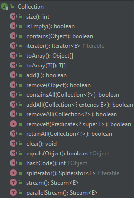
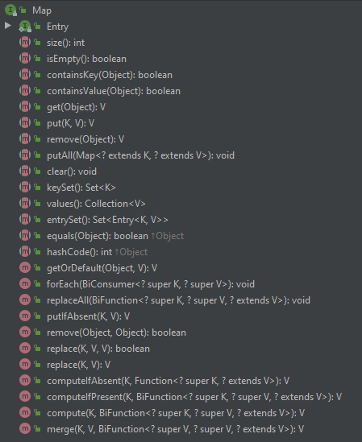

# Java三大集合框架<!-- omit in toc -->

- [Collection 接口](#collection-接口)
  - [Collection常用方法](#collection常用方法)
  - [List](#list)
  - [Set](#set)
  - [Queue](#queue)
- [Map接口](#map接口)
  - [Map常用方法](#map常用方法)
- [Reference](#reference)

首先放个框架图，上层接口分为两类，也就是```Collection```和```Map```

平常说得多的三大集合就是```List```,```Set```,```Map```,```List```和```Set```继承自```Collection```

在Java 2之前，Java是没有完整的集合框架的。它只有一些简单的可以自扩展的容器类，比如Vector，Stack，Hashtable等。这些容器类在使用的过程中由于效率问题饱受诟病，因此在Java 2中，Java设计者们进行了大刀阔斧的整改，重新设计，于是就有了现在的集合框架。需要注意的是，之前的那些容器类库并没有被弃用而是进行了保留，主要是为了向下兼容的目的，但我们在平时使用中还是应该尽量少用。


## Collection 接口



```Collection```接口是处理对象集合的根接口，其中定义了很多操作的方法

```AbstractCollection```是提供```Collection```部分实现的抽象类

### Collection常用方法

* ```add()```添加一个元素，
* ```addAll()```将指定集合中的所有元素添加到集合中
* ```contains()```方法检测集合中是否包含指定的元素
* ```toArray()```方法返回一个表示集合的数组

```Collection```有三个重要的扩展接口，分别是```List```,```Set```和```Queue```

### List

```List```扩展自```Collection```，是一个允许重复的有序集合，主要增加了面向位置的操作，允许在指定位置上操作元素，同时增加了一个能够双向遍历线性表的列表迭代器```ListIterator```。

* ```AbstractList```抽象类提供了```List```接口的部分实现
* ```AbstractSequentialList```扩展自```AbstractList```，主要提供了对链表的支持

```List```还有两个比较重要的具体实现类
* ```ArrayList``` 不定长对象数组
* ```LinkedList```链表对象

### Set

```Set```接口扩展自```Collection```，它与```List```的不同之处在于，规定```Set```的实例不包含重复的元素。

* ```AbstractSet```是一个实现```Set```接口的抽象类

```Set```有三个具体实现类
* ```HashSet``` 散列集实际上基于```HashMap```
* ```LinkedHashSet``` 链式散列集 ```LinkedHashSet```是继承自```HashSet```的，支持对规则集内的元素排序。```HashSet```中的元素是没有被排序的，而```LinkedHashSet```中的元素可以按照它们插入规则集的顺序提取。
* ```TreeSet```树形集 ```TreeSet```扩展自```AbstractSet```，并实现了```NavigableSet```，```AbstractSet```扩展自```AbstractCollection```，树形集是一个有序的```Set```，其底层是一颗树，这样就能从```Set```里面提取一个有序序列了。在实例化```TreeSet```时，我们可以给```TreeSet```指定一个比较器```Comparator```来指定树形集中的元素顺序。树形集中提供了很多便捷的方法。

### Queue


```Queue```接口中方法offer表示向队列添加一个元素，poll()与remove()方法都是移除队列头部的元素，两者的区别在于如果队列为空，那么poll()返回的是null，而remove()会抛出一个异常。方法element()与peek()主要是获取头部元素，不删除

* 接口```Deque``` 扩展自```Queue```的双端队列，支持两端插入和删除，```LinkedList```类实现了```Deque```接口，一般直接用```LinkedList```来创建一个队列

## Map接口

Map，图，是一种存储键值对映射的容器类，在Map中键可以是任意类型的对象，但不能有重复的键，每个键都对应一个值，真正存储在图中的是键值构成的条目



### Map常用方法

更新方法

* clear()
* put()
* putAll()
* remove()

查询方法

* containsKey()
* containsValue()

Map下有三个具体实现类
* ```HashMap``` 是基于哈希表的```Map```接口的非同步实现
* ```LinkedHashMap``` 继承自```HashMap```，但是它主要用链表来扩展```HashMap```.LinkedHashMap中元素既可以按照它们插入图的顺序排序，也可以按它们最后一次被访问的顺序排序
* ```TreeMap```基于红黑树数据结构的实现，键值可以使用```Comparable```或```Comparator```接口来排序。```TreeMap```继承自```AbstractMap```，同时实现了接口```NavigableMap```，而接口```NavigableMap```则继承自```SortedMap```。```SortedMap```是Map的子接口，使用它可以确保图中的条目是排好序的

在实际使用中，如果更新图时不需要保持图中元素的顺序，就使用```HashMap```，如果需要保持图中元素的插入顺序或者访问顺序，就使用```LinkedHashMap```，如果需要使图按照键值排序，就使用```TreeMap```。

## Reference

* [Java-集合框架完全解析](https://www.jianshu.com/p/63e76826e852)
* [How 2 java](https://how2j.cn/k/collection/collection-arraylist-list/686.html#nowhere)